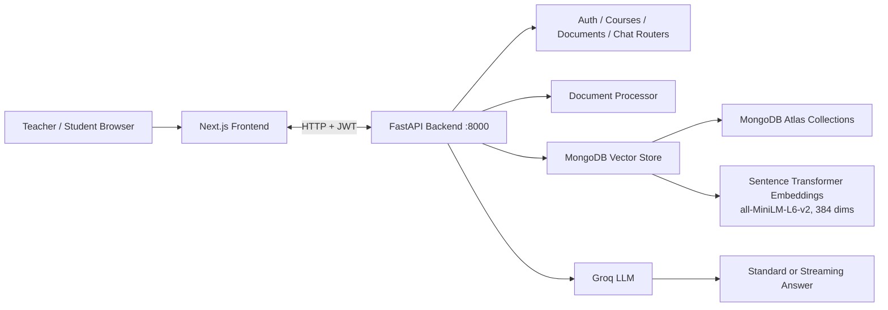

# ThinkMate System Architecture

This document summarizes the current ThinkMate runtime, data flow, and service boundaries.

## Overview

ThinkMate is a two-tier web application:

- Next.js frontend for teacher and student experiences.
- FastAPI backend for authentication, course/document management, chat, and analytics.
- MongoDB Atlas for application data and vector storage.
- Sentence Transformers for embeddings and Groq for response generation.

## Runtime Topology



## Request Flow

### Teacher workflow

1. Register or log in and receive a JWT.
2. Create a course through the course API.
3. Upload PDF, DOCX, or TXT documents to that course.
4. The backend validates the file, extracts text, chunks it, embeds the chunks, and stores both metadata and vectors in MongoDB Atlas.

### Student workflow

1. Register or log in and receive a JWT.
2. Browse available courses.
3. Ask a course-specific question.
4. The backend embeds the query, searches the vector index, builds a context window from retrieved chunks plus recent conversation history, and sends that prompt to Groq.
5. The frontend can receive either a normal response or an NDJSON token stream, depending on the endpoint used.

## RAG Pipeline

### Document ingestion

```text
Upload -> Validate file type and size -> Extract text -> Chunk text -> Embed chunks -> Store vectors and metadata
```

- PDF extraction uses PyPDF2.
- DOCX extraction uses python-docx.
- TXT files are decoded as UTF-8.
- Chunking is currently configured for 500 characters with 50 characters of overlap.
- Embeddings use sentence-transformers/all-MiniLM-L6-v2, producing 384-dimensional vectors.

### Query answering

```text
Question -> Embed query -> Vector search -> Top relevant chunks -> Build prompt context -> Groq response -> Save chat history
```

- Retrieval uses MongoDB Atlas Vector Search with cosine similarity.
- The prompt combines retrieved chunks, course context, and the most recent conversation messages.
- Streaming chat emits NDJSON chunk events and finishes with a done event that includes sources and conversation metadata.

## Data Model

### MongoDB collections

- `users`: authentication identity, hashed password, role, timestamps.
- `courses`: course ownership, course ID, display name, document count, timestamps.
- `documents`: uploaded file metadata, document type, chunk count, timestamps.
- `chat_history`: per-student conversation state, per-course message history, timestamps.

### Vector collection

Each document chunk is stored with its embedding and retrieval metadata in the configured vector collection.

```text
document_chunks
├─ vector_id: String
├─ course_id: String
├─ content: String
├─ embedding: Float[384]
└─ metadata
   ├─ document_id: String
   ├─ filename: String
   ├─ chunk_index: Number
   └─ total_chunks: Number
```

## Security

- Authentication uses JWT tokens signed with HS256.
- Tokens expire after 24 hours by default.
- Token payload includes the user email and role.
- Teacher routes are restricted to course and document management.
- Student routes are restricted to browsing and chat workflows.

## Backend Services

```text
main.py                   FastAPI entry point
app/config.py             Environment and runtime settings
app/database.py           MongoDB connection
app/auth.py               JWT helpers and access control
app/document_processor.py Text extraction and chunking
app/vector_store.py       Embedding generation and Atlas Vector Search
app/llm.py                Groq prompt and response handling
app/routers/              API route modules
```

## API Surface

### Public

- `POST /auth/register`
- `POST /auth/login`

### Authenticated

- `GET /auth/me`

### Teacher only

- `POST /courses`
- `DELETE /courses/{id}`
- `POST /documents/courses/{id}/upload`
- `GET /documents/courses/{id}/documents`
- `DELETE /documents/{id}`

### Student only

- `POST /chat`
- `POST /chat/stream`
- `GET /chat/history`
- `GET /chat/history/{id}`
- `DELETE /chat/history/{id}`

### Shared

- `GET /courses`
- `GET /courses/{id}`

## Repository Layout

```text
server/
├── main.py
├── requirements.txt
├── app/
│   ├── config.py
│   ├── database.py
│   ├── models.py
│   ├── auth.py
│   ├── vector_store.py
│   ├── document_processor.py
│   ├── llm.py
│   └── routers/
└── README.md
```

## Notes

- The backend currently uses MongoDB Atlas Vector Search, not a separate ChromaDB service.
- Embedding and vector-search dimensions are set to 384 to match all-MiniLM-L6-v2.
- Optional exam-generation flows can use Gemini, but the core tutoring path is Groq-backed.
